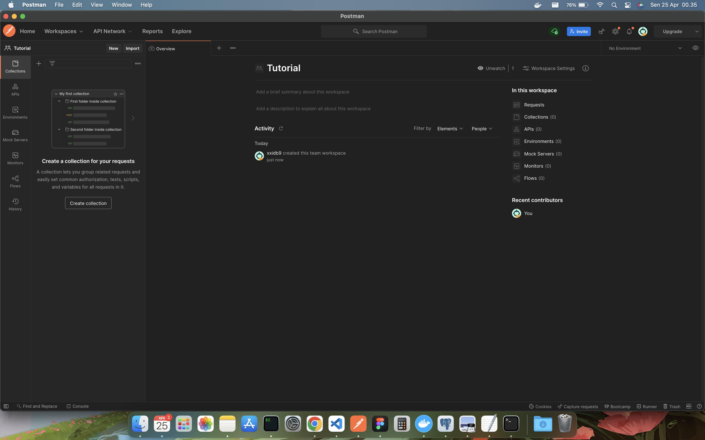
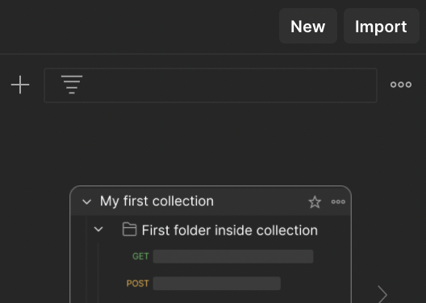
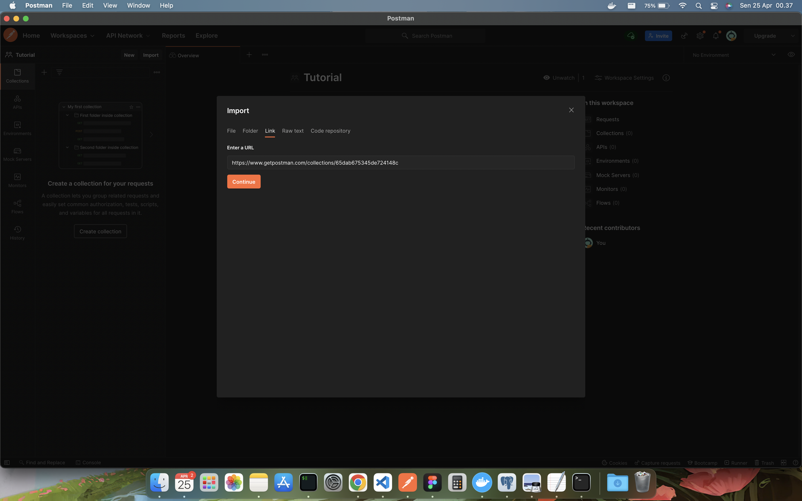
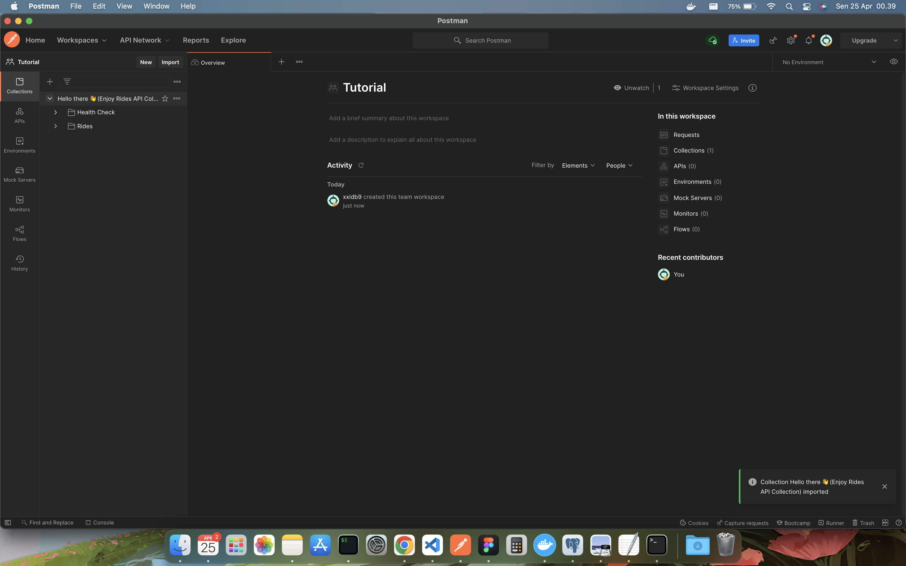
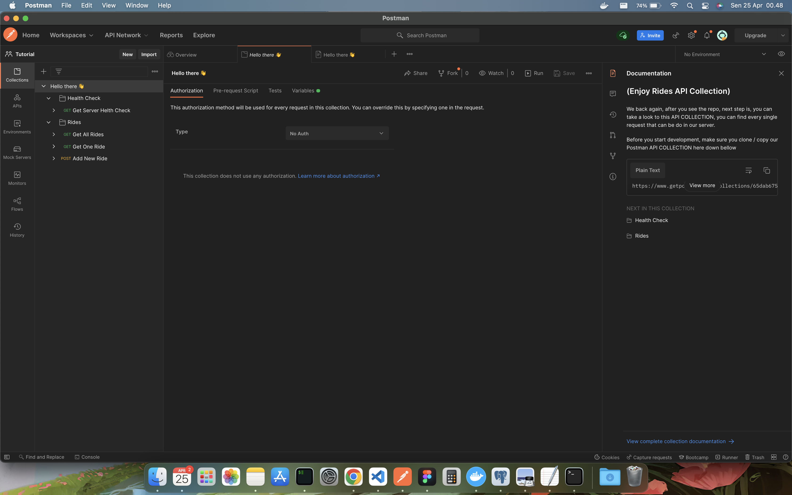
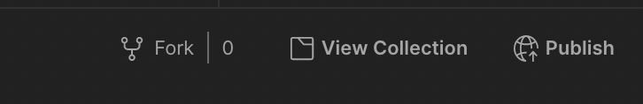
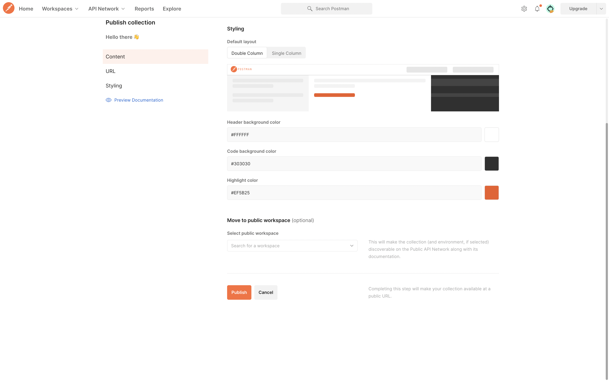
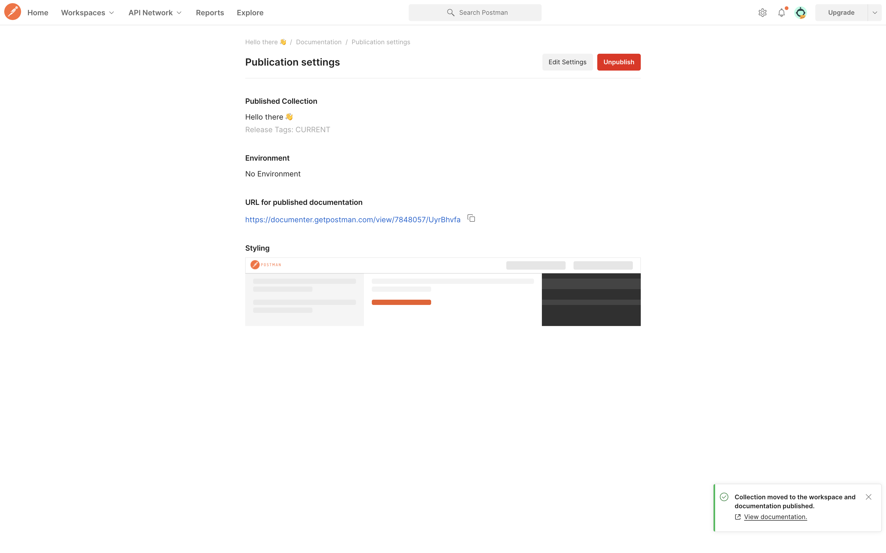

# Hello there, welcome aboard 👋
At first, we congratulate you for joining us as a backend-engineer (node-js)

## Table of Contents
1. [What you need](#what-you-need)
1. [Tools : Node Js](#node-jshttpsnodejsorgdistv10241)
1. [Tools : Postman](#postmanhttpswwwpostmancom)
1. [API Documentation](#api-documentation)

## What you need
before we start our journey, make sure this all tools what we need in the development process are installed properly in your local machine

⬆️ [back to top](#table-of-contents)
#### [Node js](https://nodejs.org/dist/v10.24.1/)
Make sure you install node js version between v8 to v10, you can download it from [here]((https://nodejs.org/dist/v10.24.1/)) or you can use [NVM](https://github.com/nvm-sh/nvm) if your running on Unix-like system (Mac,Linux, etc)

⬆️ [back to top](#table-of-contents)

#### [Postman](https://www.postman.com/)
We do not forget using tools for sharing the APO collection, make sure you install [Postman](https://www.postman.com/), and clone the collection bellow under this section 

⬆️ [back to top](#table-of-contents)


#### API Documentation
After you download Postman, you can see our collections API's inside Postman application

here copy this our api collections link bellow
```bash
https://www.getpostman.com/collections/65dab675345de724148c
```

Or go to see all API Spec [here]

##### How to clone API Collections
1.  Open Postman apps


1. Import and use the previous link



1. And done, you can play around with it 🚀


⬆️ [back to top](#table-of-contents)

##### Publish API Collections
1. On right sidebar, click documentation icon, and click ```View complete collection documentation``` in bottom of the menu


1. And after that, click ```Publish``` in top right of the menu, to start publish as a website documentation


1. And after that, click ```Publish``` in top right of the menu, to start publish as a website documentation


1. Finally we will get the API Spec Documentation


Here the example 
```text
https://documenter.getpostman.com/view/7848057/UyrDCvYf
```


